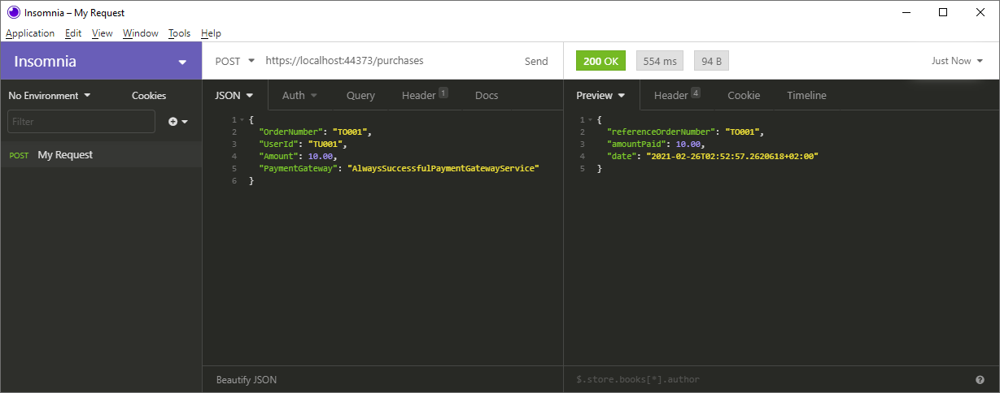

# Simple Billing API

This repository contains a simple Billing API for submitting order details, processing payment and receiving payment receipt.

## Billing Service
When the billing service processes order, it sends the order to an appropriate payment gateway. If the order is processed successfully by the payment gateway, the billing service creates a receipt and returns it in response.

**Disclaimer:** API currently doesn't support real payment gateways but instead implements dummy PaymentGateway services to simulate payment processing and to test succesful and failed payments.

Actual payment processing was determined to be out of scope at this moment.

### Example

Test order JSON
```
{
	"OrderNumber" : "TO001",
	"UserId" : "TU001",
	"Amount" : 10.00,
	"PaymentGateway" : "AlwaysSuccessfulPaymentGatewayService"
}
```

Test Result

